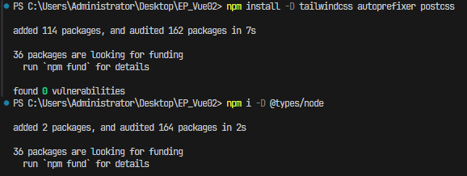
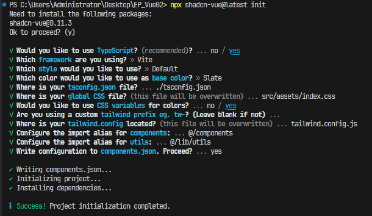

# Vue.js + Shadcn UI를 활용한 날씨 API 웹 애플리케이션 만들기

### 프로젝트 개요

안녕하세요! '구디사는 개발자 9Diin' 입니다.  
해당 프로젝트는 Vue.js의 컴포지션 API와 Shadcn UI라는 디자인 시스템을 활용하여 대시보드를 만들어 보는 프로젝트입니다.  
더불어 날씨 API와 네이버 맵 API를 활용하여 완성도를 높여보도록 하겠습니다.

### 프로젝트 기능 소개

1. Shadcn UI를 활용하여 UI를 구성하기 (Vue.js 버전에 맞도록)
2. 날씨 API를 활용하여 데이터 바인딩을 진행 (초깃값은 'seoul')
3. 네이버맵 API를 개별 인증키를 사용하여 로드 (마커 생성 및 마커 클릭 이벤트 구현)
4. Pinia를 통해 중앙집중식 상태관리를 통해 필요한 상태(state) 값들을 관리

---

### 프로젝트 생성 및 환경설정

1. 프로젝트 설치: `npm create vite@latest` 명령어를 통해 Vue 프로젝트와 TypeScript를 선택한다.
2. Shadcn-vue 설치

-   Add Tailwind and its configuration
    -   `npm install -D tailwindcss autoprefixer postcss`
-   Update vite.config.ts
    -   (so you can import "path" without error) `npm i -D @types/node`
-   Run the shadcn-vue init command to setup your project
    -   `npx shadcn-vue@latest init`

 

  

3. Vue Router 설치: `npm install vue-router@4`
4. SASS/SCSS 설치: `npm install -D sass-embedded`

---

### 프로젝트 개발에 필요한 Shadcn UI 컴포넌트 설치

1. `npx shadcn-vue@latest add button`
2. `npx shadcn-vue@latest add card`
3. `npx shadcn-vue@latest add input`
4. `npx shadcn-vue@latest add separator`
